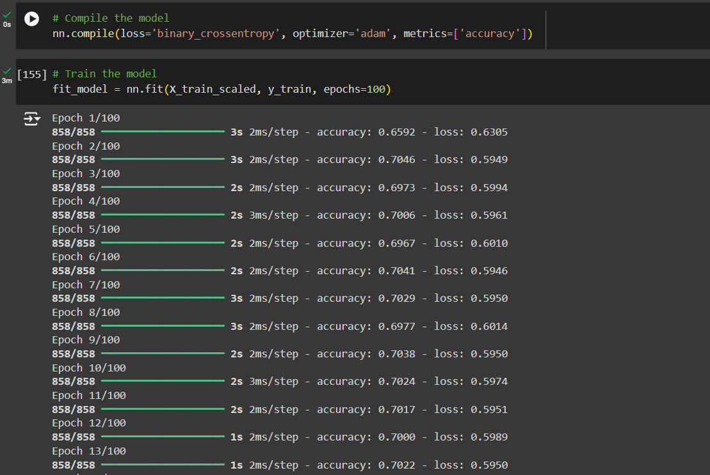
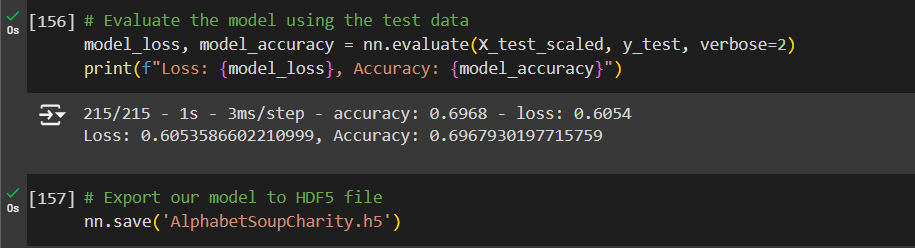

# Alphabet Soup Model Analysis

## Results

### Data Preprocessing

#### Target Variable:
- The target variable for this model is `IS_SUCCESSFUL`, which indicates whether or not an applicant successfully used the funds.

#### Feature Variables:
The feature variables used in the model include:
- `APPLICATION_TYPE`
- `AFFILIATION`
- `CLASSIFICATION`
- `USE_CASE`
- `ORGANIZATION`
- `STATUS`
- `INCOME_AMT`
- `SPECIAL_CONSIDERATIONS`
- `ASK_AMT`

#### Removed Variables:
- The `EIN` and `NAME` columns were removed from the dataset because they are identification numbers that do not contribute to the prediction.

---

### Compiling, Training, and Evaluating the Model

#### Neurons, Layers, and Activation Functions:
- I tried multiple different ways to increase accuracy, and no matter what I did I could not get the accuracy to 75%. I tried getting rid of extra columns, adding more hidden layers, and adding more neurons on the hidden layers but at a certain point it started to lower the accuracy. In the end, this is what I ended up using and I tried to maximize the performance as much as I could. 
- The neural network model consisted of four layers along with the output layer:
  - **Hidden Layers**:
    - The first hidden layer had 48 neurons, using the `relu` activation function.
    - The second hidden layer had 24 neurons, also using the `relu` activation function.
    - The third hidden layer had 12 neurons, also using the `relu` activation function.
  - **Output Layer**: The output layer consisted of a single neuron with a `sigmoid` activation function to produce a binary classification (successful or unsuccessful).
    
 

#### Model Performance:

- **Accuracy**: The model achieved an accuracy of 69.68%, falling short of the target accuracy of 75%.
  

#### Steps to Increase Performance:
1. **Data Preprocessing Adjustments**: 
   - Categorical variables with many unique values, such as `APPLICATION_TYPE` and `CLASSIFICATION`, were grouped into "Other" categories to reduce noise in the data. This had little to no effect on the accuracy.
   
2. **Architecture Modifications**: 
   - The number of neurons and layers was increased to add more complexity to the model. At a certain point, it became clear that I was overfitting so I reverted back to 48, 24, and 12 neurons for the hidden layers.
  
3. **Adding more Epochs**
   - At first, I started with 25 epochs. When observing the training, it seemed like the accuracy was improving towards the end. When I increased the epochs, it didn't have a considerable effect on the accuracy but there was a noticeable change. 
  
3. **Dropout layer**
   - I tried adding a dropout layer to prevent overfitting, but found that it also had little to no effect on the accuracy so I removed it.
   
5. **Feature Scaling**: 
   - StandardScaler was used to normalize the input features, ensuring that the model was not influenced by the varying scales of the different features.

---

### Summary
- While the model achieved an accuracy of approximately 70%, it did not meet the target of 75%. However, the model demonstrated some predictive power, and several optimization strategies were employed, including adjustments to the neural network architecture and adding more epochs.

---

### Recommendation:
- To further improve the accuracy of the model, I would trt experimenting with other machine learning models such as **Random Forest**, however it didn't seem like this project was supposed to include it based on the instructions. These models are often better suited for tabular data and could potentially yield better results for this classification problem.
