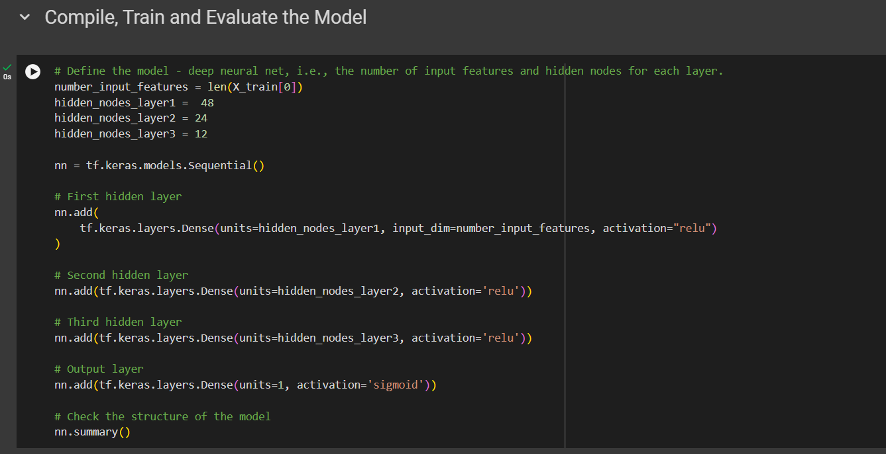

# Alphabet Soup Model Analysis

## Results

### Data Preprocessing

#### Target Variable:
- The target variable for this model is `IS_SUCCESSFUL`, which indicates whether or not an applicant successfully used the funds.

#### Feature Variables:
The feature variables used in the model include:
- `APPLICATION_TYPE`
- `AFFILIATION`
- `CLASSIFICATION`
- `USE_CASE`
- `ORGANIZATION`
- `STATUS`
- `INCOME_AMT`
- `SPECIAL_CONSIDERATIONS`
- `ASK_AMT`

#### Removed Variables:
- The `EIN` and `NAME` columns were removed from the dataset because they are identification numbers that do not contribute to the prediction.

---

### Compiling, Training, and Evaluating the Model

#### Neurons, Layers, and Activation Functions:
- I tried multiple different ways to increase accuracy, and no matter what I did I could not get the accuracy to 75%. I tried getting rid of extra columns, adding more hidden layers, and adding more neurons on the hidden layers but at a certain point it became overkill which is why I added the dropout layer as well as the early stopping function. In the end, this is what I ended up using and I tried to maximize the performance as much as I could. 
- The neural network model consisted of four layers along with the output layer:
  - **Hidden Layers**:
    - The first hidden layer had 256 neurons, using the `relu` activation function.
    - The second hidden layer had 128 neurons, also using the `relu` activation function.
    - The third hidden layer had 64 neurons, also using the `relu` activation function.
    - The fourth hidden layer had 32 neurons, also using the `relu` activation function.
  - **Output Layer**: The output layer consisted of a single neuron with a `sigmoid` activation function to produce a binary classification (successful or unsuccessful).
    
 

#### Model Performance:

- **Accuracy**: The model achieved an accuracy of 69.55%, falling short of the target accuracy of 75%.
- **Loss**: The model's binary cross-entropy loss metric was used to assess how well the model performed on the training and validation data.
  

#### Steps to Increase Performance:
1. **Data Preprocessing Adjustments**: 
   - Categorical variables with many unique values, such as `APPLICATION_TYPE` and `CLASSIFICATION`, were grouped into "Other" categories to reduce noise in the data.
   
2. **Architecture Modifications**: 
   - The number of neurons and layers was increased to add more complexity to the model. Additionally, dropout layers were added to prevent overfitting.
   
3. **Early Stopping**: 
   - Early stopping was implemented to avoid overfitting by halting the training process once the validation loss stopped improving.
   
4. **Feature Scaling**: 
   - StandardScaler was used to normalize the input features, ensuring that the model was not influenced by the varying scales of the different features.

---

### Summary
- While the model achieved an accuracy of approximately 70%, it did not meet the target of 75%. However, the model demonstrated some predictive power, and several optimization strategies were employed, including adjustments to the neural network architecture and hyperparameter tuning.

---

### Recommendation:
- To further improve the accuracy of the model, I would trt experimenting with other machine learning models such as **Random Forest**, however it didn't seem like this project was supposed to include it based on the instructions. These models are often better suited for tabular data and could potentially yield better results for this classification problem.
